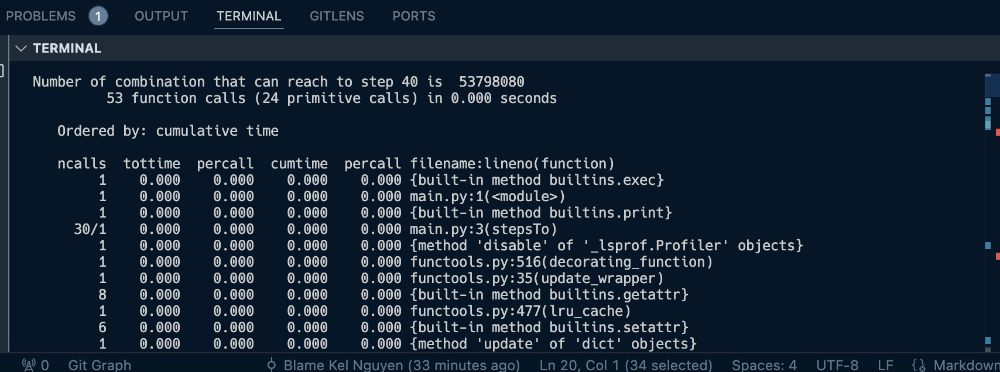

# MSCS532_HPC

## Setup
- **Step 1:** Download python https://www.python.org/downloads/
- **Step 2:** Download python extension from vsc https://code.visualstudio.com/
- **Step 3:** Download pip https://www.geeksforgeeks.org/how-to-install-pip-in-macos/
```
curl https://bootstrap.pypa.io/get-pip.py -o get-pip.py
python3 get-pip.py
```
- **Step 3:** Download memory profile (since cProfile is part of Python's in-house dependency )
```
pip install -U memory_profiler
```

## Output
To run the sorting with corresponding profiler, we need to execute the the following commands:
- **Memory profiler:**
```
python3 -m memory_profiler main.py
```


- **CPU Profiler:**
```
python3 -m cProfile main.py
```



